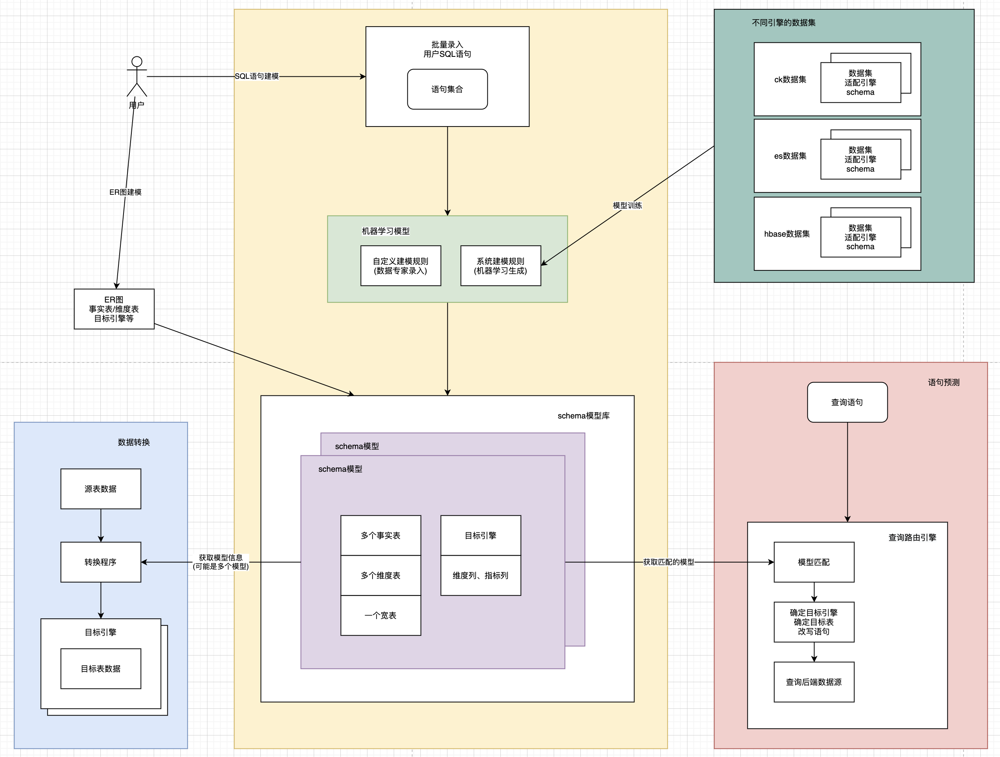

## 系统架构图


## 建模过程与模型应用



## 智能路由

智能路由是指将用户发起查询请求的sql语句，通过查询路由引擎打到后端合适的目标存储引擎上，而用户不需要关注到底是哪个目标存储引擎执行的计算。

实现方式是：查询路由引擎对语句进行模型匹配（把语句发给特征分析引擎，特征分析引擎对该语句作预测，返回与之匹配的目标引擎）。因此智能路由还是依赖智能建模的结果。

### 候选项目对比

目前调研了两个支持”统一查询”的开源项目：facebook的presto和360的quicksql。

|                 | presto                           | quicksql                           |
| --------------- | -------------------------------- | ---------------------------------- |
| ANSI标准SQL     | 支持                             | 支持                               |
| 联邦查询        | 支持                             | 支持                               |
| 交互式查询      | 支持                             | 不支持                             |
| 元数据存储      | 无                               | 有                                 |
| sql plan框架    | 自主开发                         | calcite                            |
| 计算引擎        | 自主开发                         | spark/flink                        |
| 如何支持etl场景 | presto on spark                  | spark本身就支持                    |
| connector       | hive, clickhouse, es, phoenix    | hive, clickhouse, es               |
| 成熟度          | 比较成熟，社区活跃，周边工具完善 | 不成熟，社区不活跃，周边工具不完善 |

选择presto的主要原因：

- 支持的connector种类比较丰富
- 生态完善，减少后期产品化的开发工作量
- presto天然支持即席查询，对etl场景支持得不如spark好。但最近presto开发了presto-on-spark项目，底层用spark core执行任务调度，弥补了presto在fault tolerance方面的不足。

### 智能路由功能

#### 需求

1. 不同的数据源里存储的是不同的数据（表名不同）：presto能够识别不同的表名，路由到不同的数据源。
2. 不同的数据源里存储同一份数据（数据冗余存储）：目前不支持。需要根据查询语句的特征，选择一个最优的后端引擎。

#### 设计

查询执行计划的生成主要分成如下4个阶段：

- parse：生成AST。

- analyze：绑定元数据信息，生成逻辑执行计划。

- optimize：优化逻辑执行计划。

- physical：生成物理执行计划。

显然，路由规则应该作用于analyze阶段。

## 智能建模

建模指的是把原始schema模型转成目标shema模型，譬如将Hive中表的定义和关联关系转成Clickhouse中宽表定义。建模过程不包括数据转换。

### 需求

#### 1.SQL语句建模

许多⽤户希望能够依据 SQL 查询语句，⾃动地创建好⼀个可⽤的模型，然后进⾏后续的模型优化或调整。

- 智能建模的输入：

  (1)批量导入：从界面批量导入用户的查询语句，一次性生成模型。

  (2)即时采集：系统记录用户输入的查询语句，并构建原始语句集，用于后续生成模型。在这种方式下，当用户输入查询时还没有目标引擎，所以查询请求将通过presto打到hive上（需要验证presto => hive的性能）。

- 智能建模的输出：

  (1)目标引擎

  (2)适用于目标引擎的模型（参见“模型的要素”）。

#### 2.ER图建模

用户手动指定hive表的如下信息：事实表、维度表、关联关系，构建出ER图。

系统根据ER图构建目标引擎的模型。这个模型是一个全量的模型，它包含了表之间存在的所有关联关系；而“SQL语句建模”很可能不是全量的。

先通过“ER图建模”生成全量模型，后续再通过“SQL语句建模”对全量模型作剪枝，去掉用户根本不会用到的关联查询。

### 设计

模型要素包括：

- 事实表、维度表：分析出hive中哪些表是事实表，哪些表是维度表。
- 表与表的关联关系：通过分析事实表、维度表之间的join的条件得到。
- 宽表：事实表和维度表通过join之后可以产生的宽表。
- 维度列、度量列：通过分析group by和聚合函数得到。
- 目标引擎：clickhouse, es, hbase。

重要概念：

- 可计算列：将原始表的列进行某种计算，如将“单价”与“数量”相乘，得到“总价”（`total=price*amount`）。可计算列可以作为维度或度量。当用户查询时，引擎把对`price*amount`的查询翻译成对`total`的查询。显式查询是对查total，隐式查询是查price*amount。
- 索引：针对维度列建立的索引。

### 选择目标引擎

如何根据语句特征，决定使用哪一个目标引擎？

### ClickHouse模型设计

ck适用宽表模型，目标是将星型模型、雪花模型中多个表的`join...group by...`做成一张大宽表。

定义：

- dim_columns：表示维度列。
- metric_columns：表示度量列（或叫指标列）。

#### 1.单条原始语句

```
1.用户的原始查询语句：
select A.dim_columns, B.dim_columns, C.dim_columns, 
       aggregateFunction(A.metric_columns,B.metric_columns,C.metric_columns)
from A,B,C
on A.a = B.b1 and B.b2=c.c
where ...
group by A.dim_columns, B.dim_columns, C.dim_columns
order by ...

2.生成模型的语句：
insert into WIDE select A.dim_columns, B.dim_columns, C.dim_columns, A.metric_columns,B.metric_columns,C.metric_columns
from A,B,C
on A.a = B.b1 and B.b2=c.c
加视图

3.那么宽表的列由以下列组成：
[A.dim_columns, B.dim_columns, C.dim_columns, A.metric_columns, B.metric_columns, C.metric_columns]
```

#### 2.多条原始语句

```
1.假设有5个原始语句：
Q1 = A join B join C
Q2 = B join D
Q3 = D join E join F
Q4 = G join H
Q5 = H join I

2.生成表的关联关系图（每个图里最多有两个事实表）：
(1)图1（假设B、D是事实表，则E不能是事实表）：
A-B-C
  |
  D-E-F
(2)图2：
G-H-I
  
3.对每个独立的图构建一张宽表：
(1)图1：[{A,B,C,D,E,F}的维度列和度量列]
(2)图2：[{G,H,I}的维度列和度量列]
```

问题：

- 怎么用最少的图覆盖最多的SQL语句？
- 不同的join类型对应的处理方式是什么样的？left join, right join等
- 数据量缺失的问题：首先要确定哪些表是事实表，然后限制每个图里最多有两个事实表。

#### 3.细化场景

(1) 关联的表**一样**，等值条件**一样**，但是维度列/指标列**不一样**：生成一张宽表。

```
Q1 = A join B on A.a=B.b，维度列和指标列是{A.dim_a1, B,dim_b1, A.metric_a1, B.metric_b1}
Q2 = A join B on A.a=B.b，维度列和指标列是{A.dim_a2, B,dim_b2, A.metric_a2, B.metric_b2}
生成1张宽表：
[A.dim_a1, B,dim_b1, A.dim_a2, B,dim_b2, A.metric_a1, B.metric_b1, A.metric_a2, B.metric_b2]
```

(2) 关联的表**一样**，等值条件**不一样**：生成多张宽表。

```
Q1 = A join B on A.a1=B.b1，维度列和指标列是{A.dim_a1, B,dim_b1, A.metric_a1, B.metric_b1}
Q2 = A join B on A.a2=B.b2，维度列和指标列是{A.dim_a2, B,dim_b2, A.metric_a2, B.metric_b2}
分别生成2张宽表：
[A.dim_a1, B,dim_b1, A.metric_a1, B.metric_b1]
[A.dim_a2, B,dim_b2, A.metric_a2, B.metric_b2]
```

#### 4.新增语句

当新的查询语句无法被已有的模型覆盖时，此时可能有两种选择，一种是优化现有模型，一种是新建模型。例如：

```
1.当前模型图是：
A-B-C
  |
  D-E-F
  
2.新的查询是：C join E

3.方案：
(1)优化现有模型：
A-B-C
  | |
  D-E-F
(2)新建模型：
C-E

4.结论：
方案(1)需要重构宽表数据，且宽表中的数据量较大。
方案(2)的宽表中的数据量较小，C join E的查询时间更短。
如果“C join E”的查询非常频繁，那么第(2)种方式更合适。
```

#### ck的能力支持

1.ck的宽表示例

- Star Schema Benchmark https://clickhouse.tech/docs/en/getting-started/example-datasets/star-schema/

2.ck的group by

如果在ck中执行的group by的字段，是sort by字段的前缀，那么聚集操作会更高效，以下来自ck文档：

https://clickhouse.tech/docs/en/sql-reference/statements/select/group-by/#implementation-details

> The aggregation can be performed more effectively, if a table is sorted by some key, and GROUP BY expression contains at least prefix of sorting key or injective functions.

3.ck可以添加或删除跳数索引

https://clickhouse.tech/docs/en/sql-reference/statements/alter/index/

4.物化视图添加或删除列

ALTER <materialized view name> MODIFY QUERY <select_query> 
目前虽然merge了，但是官网没有找到相关介绍，根据参数介绍该原语还不能保证原子性（work in progress）

### ElasticSearch的模型设计


### HBase的模型设计

