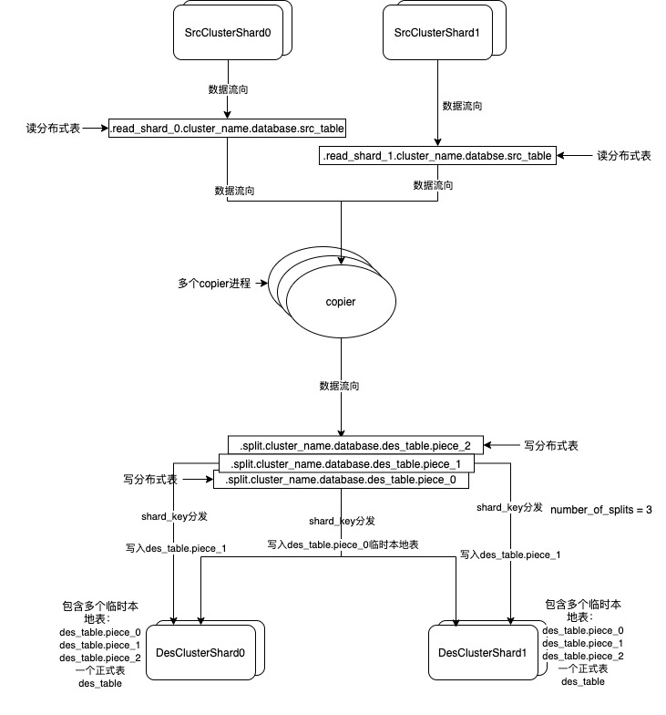

# clickhouse-copier分析调研

##### 工具参数

```
daemon — 后台运行copier工具，进程将在后台启动。 

config — zookeeper.xml的存放路径，用来连接zookeeper集群。

task-path — zookeeper上的存储节点路径，例如：/clickhouse/copier_tasks/task1;该路径中的内容用来存储复制任务，以及多个copier进程间的协调信息，建议不同的数据复制任务，路径不要重名，例如：/clickhouse/copier_tasks/task2,task3,task4,或者每天同步做一次数据copy的话，也可以以当天日期命名，task-2021-01-27，但同一任务的不同copier进程要保持一致的配置路径。

task-file — 指向配置了复制任务的配置文件，例如：copy-job.xml,该文件内容会上传到zookeeper的/clickhouse/copier_tasks/task1/description节点。

task-upload-force — 若设置为true,那么将根据task-file文件的内容，强制刷新覆盖上个参数提到的zookeeper的description节点。

base-dir — 会存储一些日志以及相关的辅助型文件，copier工具进程启动后，会在$base-dir创建copier_YYYYMMHHSS_<PID>格式的子目录（日志文件会在该子目录下，以及辅助型分布式表的相关信息在data目录下），若没有传该参数，则在copier运行的当前目录创建。
```
##### 配置参数

[zookeeper.xml](https://clickhouse.tech/docs/en/operations/utilities/clickhouse-copier/#format-of-zookeeper-xml)

logger.level: 日志级别，可以设置:

```
FATAL = 1,   /// A fatal error. The application will most likely terminate. This is the highest priority.
CRITICAL,    /// A critical error. The application might not be able to continue running successfully.
ERROR,       /// An error. An operation did not complete successfully, but the application as a whole is not affected.
WARNING,     /// A warning. An operation completed with an unexpected result.
NOTICE,      /// A notice, which is an information with just a higher priority.
INFORMATION, /// An informational message, usually denoting the successful completion of an operation.
DEBUG,       /// A debugging message.
TRACE        /// A tracing message. This is the lowest priority.
```

logger.size: 设置当达到多少size时日志进行rotate.

logger.count: archive文件的日志数量达到这个值时开始清除老的archive文件.

[copy-job.xml](https://clickhouse.tech/docs/en/operations/utilities/clickhouse-copier/#configuration-of-copying-tasks)

这里大多数配置文档中均有介绍，特殊强调几个配置：

```
number_of_splits(官方没有给出它的用途，它和cluster_pull标签同级): 用来设置piece数量，默认是10，在复制的时候将每个partition切分成10片，每片的数据是处理的最小任务粒度，然后将每片写入到对应的辅助临时表des_table_piece_*表中，之所以要对partition进行切片到piece的粒度，第一个优点是：可以增加并行度，多个copier可以同时处理多个pieces;第二个优点则是单个pieceTask失败后的重试粒度变小了。
max_workers: 用来控制启动的copier进程的数量，当超过该值时，多余的copier会睡眠30后再尝试，之后持续等待累加。
engine: 当目的表（des_table）不存在时，会根据该engine配置创建表，以及创建临时辅助表。
sharding_key: copier进程会在内存中创建写入分布式表，此shard_key会作为写分布式表的创建参数，根据相应的shard_key规则转发到目的集群对应的shard上的临时辅助表中。
where_condition: 当查询源数据表的时候可以添加的过滤条件。
enabled_partitions: 指定具体要复制的某些分区，除了该分区，其他分区均不复制，配置中分区的顺序就是复制的顺序。
```

##### 原理梳理



假设我们在一个含有两个shard的集群上，分别在每个shard(若有replicas，选其中一个replica)上各启动一个或多个copier进程：

```
clickhouse-copier  --config /home/servers/copier/zookeeper.xml --task-path /clickhouse/copier_tasks/task1 --base-dir /home/servers/copier/clickhouse-copier --task-file /home/servers/copier/copy-job.xml --task-upload-force=true (当zookeeper中没有相关配置时，第一次初始化启动可以使用该命令参数)

clickhouse-copier  --config /home/servers/copier/zookeeper.xml --task-path /clickhouse/copier_tasks/task1 --base-dir /home/servers/copier/clickhouse-copier （当zookeeper中已有相关配置后，那么直接启动即可，无需指定后两个参数）
```
**关键字解释**：

src_cluster源集群，des_cluster 目标集群，src_table 源数据表，des_table目标数据表，.read_shard_0 这里的数字0是shard在集群中的索引可替换，piece_0 这里的数字0是切片的索引可替换，cluster_name 集群名字可替换，database 数据库名字可替换


1. copier会加载配置文件进行初始化，将**\<tables\>**下的任务统统加载进来，然后根据**<table_hits>**(可以自定义名字**table_***)中的配置去访问**src_cluster**的各个shard(这些shards会根据hostname与copier所在的机器的hostname进行diff，匹配越多的字符说明离的越近，按照从近到远进行排序)下的各个**src_table**，加载这些table的partitions（如果我们指定了enabled_partitions,那么就直接使用enabled_partitions中配置的，而不在去发请求查找所有partitions），然后将这些partitions存进任务队列，那么这些partitionTasks也是由近到远排好序的。

2. 之后循环遍历来处理任务队列中的partitionTask, 然后根据**<num_of_splits>**(如图)的配置将**partitionTas**k切分成3片（根据**src_table**主键的值做hash64%3分配后形成select查询语句来查询读分布式表），接下来开始处理每一个最小粒度的pieceTask，这些**pieceTask**同时只能被一个copier来进行处理。

3. 处理pieceTask时会根据该pieceTask所属的shard来在本地内存数据库中创建读分布式表**.read_shard_0.cluster_name.database.src_table**，该分布式表配置的本地表名就是**src_table**，以及该分布式表所在的虚拟集群**.read_shard_0.cluster_name**（该虚拟集群仅有一个shard，就是当前处理pieceTask所属的shard，由近到远，前期处理的应该都是本地的shard）也是在本地内存数据库中。

4. 创建完读分布式表后，接着创建写分布式表**.split.cluster_name.database.des_table.piece_0**，该分布式表中的创建的配置则不是虚拟集群，而是真正的**des_cluster**做为参数传入，本地表则是根据**\<engine\>**的配置来创建的辅助临时表**des_table.piece_0**（所有目的集群的shards上都会创建），具体是哪个piece取决于我们当前处理的piece索引是什么，目前我们假设是第一个的话，那就是**piece_0**，而该写分布式表的**shard_key**则是我们在copy-job.xml中所配的，根据这个**shard_key**来向目的集群的某个shard进行转发写入。

5. 在处理每个pieceTask的逻辑中会有类似INSERT INTO SELECT的语句来进行**copyData**，来将读分布式表的数据写入到写分布式表中，当发现某个临时辅助表在**第一次**被写入时里面已经有数据的情况下会进行清空的操作，然后再写入。

6. 当该**partition**的所有**pieces**都己经完成数据copy后，接下来会进行**movePartition**操作，将这些临时辅助表的数据复制到**des_table**中（此时会出现数据临时增多的现象，因为是复制操作）。**注意**：在copy数据时，之后添加的数据会无法迁移过去，所以一般是今天复制迁移昨天的数据会比较好。

7. 当整个**tableTask**的所有**partitionTasks**处理完成以后，会进行删除临时辅助表的操作，这时数据就会减少到真正的大小；如果所有的**tableTasks**都处理完以后，copier进程就会自动退出。**注意**：在删除辅助表时我们发现了一个bug，目前我们本地通过修改源码已经修复，并已经提交给社区。


##### 部署方案

建议

源集群的每个shard(若有多个replica,仅选一个replica)上均可部署copier(一个或者多个，所有copier总数，包括其他shard的加和不要超过max_workers为好)，另外copier会优先处理本机上的shard，之后按照hostname匹配程度按照优先级再去执行remote shard, 当发现自己执行的是remote shard后也会先睡眠1秒让真正属于本地的shard的copier优先执行，这样可以减少主机间的网络流量负载（特别是在生产环境下），尽量让每个shard上的copier只处理本shard的数据。

运维需要开发脚本来同时启动每个shard上的copier(一个或多个)进程，最好能够收集copier所产生的日志信息，来统一知晓哪些copier运行的是否有问题。

数据copy可以按照T+1的方式进行，每天按照日期分区做一次拷贝，避免积累太多后再复制会影响线上机器的网络资源。

##### 参考

https://clickhouse.tech/docs/en/operations/utilities/clickhouse-copier

https://blog.csdn.net/weixin_39992480/article/details/111564982

https://altinity.com/blog/2018/8/22/clickhouse-copier-in-practice

https://developer.aliyun.com/article/776070


   

